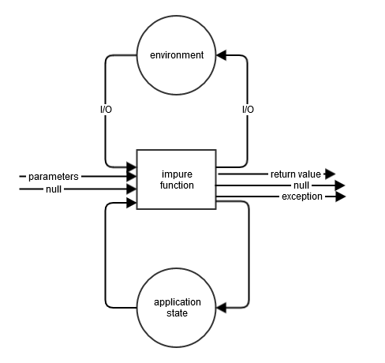

# Programowanie Funkcyjne
### Warsztat

---
<div style="float: left; z-index: -10; width: 50%; text-align: left;">

</div>

<br>

### Rafał Sumisławski

<span style="font-size: 32px;">rsumislawski@networkedassets.org</span>

<span style="font-size: 32px;">@fa[twitter](@sumislawski)</span>

<span style="font-size: 32px;">@fa[github](RafalSumislawski)</span>

+++
### O mnie

- Skończyłem Informatykę/Inżynierię Internetową na W4 PWr |
- Interesuje się: |
  - Programowaniem Funkcyjnym i Scalą |
  - Wydajnością i współbierznością na JVM |
  - Elektroniką i Metrologią |
  
+++
### O mnie

- W NA od 70 miesięcy |
- Prowadzę zespół |
  `flatCatz(_ => :cat:)` 
  - Scala / Akka / Cats |
  - MEPS |

---
### Cele warsztatu
* Zrozumienie sensu purely-functional programming
* Oswojenie się z niemutowalnymi struktuarmi danych oraz monadami

+++
### Plan
* Setup środowiska
* Wytwarzanie oprogramowania
* Programowanie Funkcyjne
* Niemutowalne struktury danych
* Higher-order Functions
* Monady i "Monady"
* Praca z kodem
* Podsumowanie

---
## Setup środowiska
 * https://dniotwartena2018.slack.com
 * IDE (IntelliJ) + Maven + Git
 * https://github.com/RafalSumislawski/functional-programming-workshop-exercises
 
---
## O co chodzi w wytwarzaniu oprograowania?


<!-- source: https://twitter.com/maeveynot/status/1074051863878778880 -->

+++
"An evolving system increases its complexity unless work is done to reduce it." 

&minus; Meir Lehman (2nd Lehman's law)

--- 

## Funkcje

"Sometimes, the elegant implementation is just a function. Not a method. Not a class. Not a framework. Just a function." 

&minus; John Carmack

+++
#### Przykład 1 wersja 1
```java
void rt1() {
    int a = getA();
    int b = getB();
    int aPlusB = getA() + getB();

    println(a + " + " + b + " = " + aPlusB);
}
```

+++
### Przykład 1 wersja 2
```java
void rt2() {
    int a = getA();
    int b = getB();
    int aPlusB = a + b;

    println(a + " + " + b + " = " + aPlusB);
}
```

+++
### Przykład 1 wersja 3
```java
void rt3() {
    int b = getB();
    int a = getA();
    int aPlusB = a + b;

    println(a + " + " + b + " = " + aPlusB);
}
```

+++
### tasks.Task1
* Zepsuj jedną lub dwie (ale nie wszystkie) z metod `rt*`
* Nie możesz zmieniać `rt*`
* Możesz zmieniać implementację `getA` i `getB` i dodawać nowy kod w tej klasie.

+++
### Przykład 2 wersja 1
```java
void v1() {
    char a = 'a';
    char b = nextLetter(a);

    println(a);
    println(b);
}
```

+++
### Przykład 2 wersja 2
```java
void v2() {
    char[] a = new char[]{'a'};
    char[] b = nextLetter(a);

    println(a);
    println(b);
}
```

+++
### tasks.Task2
* Zaimplementuj obie metody `nextLetter` tak aby zwracały kolejną literę w alfabecie

+++
### Przykład 3
```java
String loadFirstLine(String filePath) {
    ...
}
```

+++

### Przykład 3
```java
String loadFirstLine(String filePath) {
    Path path = Paths.get(filePath);
    List<String> strings = null;
    try {
        strings = Files.readAllLines(path);
        return strings.get(0);
    } catch (IOException e) {
        e.printStackTrace();
        return null;
    }
}
```
Na ile różnych sposobów to się może wykonać?

+++


+++


---

## Referential transparency & Equational reasoning

+++
### (Czysta) Funkcja

- Total |
- Deterministic |
- No side-effects |

+++
### Co nam to daje?

- funkcja nie robi nic poza tym co w sygnaturze |
- nie trzeba znać implementacji żeby analizować kod, który używa funkcji |

+++
"Think twice if you method/function returns void." 

&minus; Daniel Dietrich

+++
"In purely functional programs, there are no side-effects, so all functions can do is 'combine' their input values into output values."

&minus; John de Goes

+++
### Programowanie funkcyjne jest super, ale...

+++
- jednak potrzebujemy I/O, stanu, obsługi błędów i "nulli" 
- Od X lat programujemy imperatywnie / obiektowo |
- trzeba się sporo nauczyć |
  - Monady, Monoidy, Funktory, Izomorfizmy, Comonady, itp.
- performance |
- interakcje z kodem nie-funkcyjnym |
- Java nie była projektowana jako język funkcyjny |
  - DYSCYPLINA! 
  - albo inny język (patrz Haskel, Idris, Scala&ast;, Kotlin&ast;)
  
+++
### Java czy Scala?

---
## Immutable Data Structures

<!-- source: https://twitter.com/christopherdone/status/1016790415645831168 -->

+++
## Immutable Data Structures
- Nie chodzi o `Collections.unmodifiableList`
- Zamiast modyfikować strukturę danych, zwracamy nową |
- Specjalnie zaprojektowane struktury danych żeby zachować rozsądny performance |
- java.lang.String, java.lang.Integer są już niemutowalne |

+++
### java.util.List
```java
List<String> f1(List<String> l){
    l.add("aaa");
    l.remove("bbb");
    return l;
}
```

+++
### java.util.List v2
```java
List<String> f2(List<String> l1){
    List<String> l2 = new ArrayList<>(l1);
    l2.add("aaa");
    l2.remove("bbb");
    return l2;
}
```

+++
### io.vavr.collection.Seq
```java
Seq<String> f3(Vector<String> s1){
    Seq<String> s2 = s1.append("aaa");
    Seq<String> s3 = s2.remove("bbb");
    return s3;
}
```

+++
### io.vavr.collection.Seq v2
```java
Seq<String> f4(Vector<String> s){
    return s.append("aaa")
            .remove("bbb");
}
```

+++
### Wydajność???
* Zwykle wolniejsze niż mutowalne
* Szybsze niż kopiowanie mutlowalnych
* Korzystne w aplikacjach współbierznych
* Dla większości kodu: poprawność >> wydajność

+++
### Vavr

<!-- source:  https://www.vavr.io/vavr-docs/ -->

---
## Function values & Higher-Order Functions (HOF)
```java
Function1<Integer, Integer> addOne = x -> x + 1;
Consumer<Integer> print = System.out::println;
Vector.of(1, 2, 3).forEach(print);
Function1<Integer, Integer> addSeven = addX(7);
```

---
## Monads
"A monad is a monoid in the category of endofunctors, what's the problem?" 

&minus; James Iry

+++
### Monads
- Wartość pewnego typu owninięta w "kontekst" | 
  (`M<T>`)
- Różne monady dodają różny "kontekst" |
- Czystą wartość można owinąć w domyślny kontekst | 
  (`of`/`pure`/`unit`/`point`)
- Wartość można przetwarzać ignorująć kontekst |  
  (`map`)
- Konteksty można składać | 
  (`flatMap`/`bind`)
- dodatkowo: | 
  `flatten`, `filter`, `collect`, `forEach`, `zip`, `fold`, `travese`, `sequence`, ...

+++
### Monadic laws
- left identity:<br> |
  `M.of(value).flatMap(f) == f(value)` 
- right identity:<br> |
  `m.flatMap(M::of) == m`
- associativity:<br> | 
  `m.flatMap(f).flatMap(g) == m.flatMap(x -> f(x).flatMap(g))`

+++
### Seq
```java
Vector.of(1, 2, 3)
    .flatMap(x -> Vector.of(x, x + 10))
    .filter(x -> x % 3 == 0)
    .forEach(System.out::println);
```

+++

### Option
```java
int[] ints = {7, 77};
println(ints[10]);

List<Integer> list = new LinkedList<>();
list.add(7);
println(list.get(10));

Map<Integer, Integer> map = new TreeMap<>();
println(map.get(10));
```

+++
### Option
```java
HashMap<Integer, Integer> numbers = HashMap.of(
        1, 3,
        3, 2
);

Option<Integer> maybeResult = numbers.get(1)
        .flatMap(a -> numbers.get(a))
        .map(x -> x + 100);

println(maybeResult.getOrElse(0));
maybeResult.forEach(x -> println(x));
```

+++
### Try
```java
Try<String> f(String n) {
    return Try.of(() -> Integer.parseInt(n))
        .flatMap(i -> Try.of(() -> 100 / i))
        .map(percent -> "1/" + n + "=" + percent + "%");
}
```

+++
### tasks.Task3
* Zmień sygnaturę tak żeby lepiej opisywała działanie `loadFirstLine`
* Zmień implementację `loadFirstLine` tak żeby miała jeden punkt wyjścia

+++
### Future
```java
asyncPrintLineToConsole("Please enter a file name:")
    .flatMap(voidek -> asyncReadLineFromConsole())
    .flatMap(fileName -> asyncReadWholeFile(fileName))
    .onComplete(t -> {
        if(t.isSuccess()) println(t.get());
        else println("Failed to load the file due to: " + t.getCause().getMessage());
    });
```
 
+++
### IO Monad
```java
asyncPrintLineToConsole("Please enter a file name:")
    .flatMap(voidek -> asyncReadLineFromConsole())
    .flatMap(fileName -> asyncReadWholeFile(fileName))
    .onComplete(t -> {
        if(t.isSuccess()) println(t.get());
        else println("Failed to load the file due to: " + t.getCause().getMessage());
    }).runUnsafeAsync(threadPool);
```

+++
### Inne monady
* Either (vavr)
* Validation (vavr)
* State
* Reader
* ...

---
## Czas na kodowanie :)

---
## Podsumowanie
- Pure function: |
    - Total
    - Deterministic
    - No side-effects
- Monady jako elegancki work-around. |
- Niemutowalnych struktur danych i monad możemy używać w OOP. Nie trzeba być 100% purely-functional. |
- Tam gdzie kompilator nie pomaga, trzeba trzymać dyscyplinę :(. |

---
## Linki
* dokumentacja vavr - https://www.vavr.io/vavr-docs
* żargon FP dla Scali - https://github.com/ikhoon/functional-programming-jargon.scala